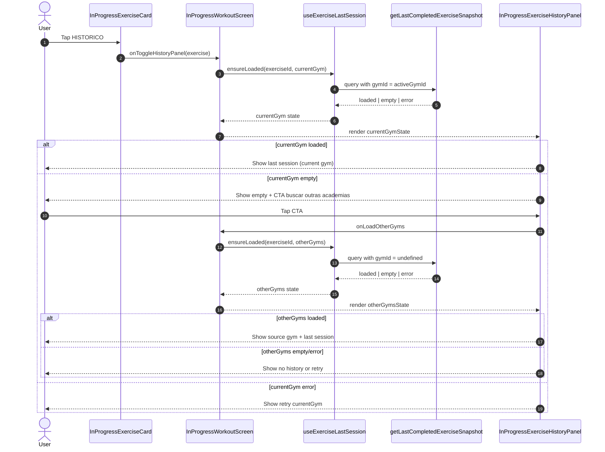

# Exercise History - Where, When, and How To Show

## Product Decision

- Do not add a new Performance tab.
- Keep comparison/history inside existing flows only:
  - Workout In Progress (primary)
  - Prepare Workout (secondary)
  - Logbook (review flow)

## Goal

Show exact historical numbers without charts, with optional interactions that never block workout logging.

---

## Current Implementation (April 2026)

This section explains the exact flow currently implemented in code for:

- last session in current gym
- fallback to other gyms if current gym has no history

### Core idea

History is loaded per exercise and per scope:

- `currentGym`: uses active workout gym filter
- `otherGyms`: no gym filter (global fallback)

Each scope has an independent state machine:

- `idle`
- `loading`
- `loaded`
- `empty`
- `error`

### Step-by-step flow in the screen

1. User opens history panel in one exercise card (`HISTORICO`).
2. Screen loads `currentGym` history only.
3. If `currentGym` returns `loaded`, panel shows that snapshot.
4. If `currentGym` returns `empty`, panel shows empty message for this gym and a CTA:
   - `BUSCAR EM OUTRAS ACADEMIAS`
5. User taps CTA to load `otherGyms` scope.
6. If `otherGyms` returns `loaded`, panel shows:
   - source gym name (`Historico encontrado em: ...`)
   - the same last-session metrics and sets list
7. If `otherGyms` returns `empty`, panel states there is no history in other gyms.
8. If `otherGyms` fails, panel shows retry only for fallback scope.

### Why it is decoupled

The decision and loading logic are separated by responsibility:

- Hook owns loading/caching by scope (`currentGym` vs `otherGyms`).
- Screen decides what to display and when to trigger fallback.
- Panel component only renders state + triggers callbacks.

This keeps business logic out of the UI component and avoids coupling fallback behavior to a single view.

### Which snapshot is used for "Copy Sets"

When the copy button is shown, the screen picks the displayed snapshot source:

- current gym snapshot, if available
- otherwise fallback snapshot from other gyms (only after explicit user action)

So copy behavior is always aligned with what user sees in the panel.

### Main files in this flow

- `features/workouts/hooks/useExerciseLastSession.ts`
  - scoped state key: `${scope}:${exerciseId}`
  - loaders: `ensureLoaded(exerciseId, scope)` and `retry(exerciseId, scope)`
- `features/workouts/InProgressWorkoutScreen.tsx`
  - opens panel, loads `currentGym`, triggers `otherGyms` on CTA
  - computes displayed state and passes callbacks to card/panel
- `features/workouts/components/in-progress/InProgressExerciseHistoryPanel.tsx`
  - renders current-gym state and fallback section
  - shows gym label and fallback source gym label
- `features/workouts/hooks/useCopySetsFromLastSession.ts`
  - receives selected history state directly
  - copies sets from whichever loaded snapshot is currently selected by the screen

### Query behavior used by the hook

`getLastCompletedExerciseSnapshot` supports gym filtering:

- `gymId = activeGymId` for current gym scope
- `gymId = undefined` for global fallback scope

Shared constraints:

- only completed workouts
- excludes active/current workout
- picks most recent session by date/creation order

### Sequence diagram (current gym with optional fallback)



---

## Active Surfaces

### Surface 1 - Workout In Progress (lazy, on-demand)

**Where:** `InProgressExerciseCard` header row inside `InProgressWorkoutScreen`  
**When:** During an active workout, per exercise, only if user asks for it  
**Why first:** Highest daily value with minimal UI noise

### Surface 2 - Prepare Workout (last time hint)

**Where:** `PrepareWorkoutScreen` -> `PrepareWorkoutExercisesForm`  
**When:** Before starting workout  
**Why second:** Strong planning signal before the session starts

### Surface 3 - Logbook (comparison summary)

**Where:** `LogbookWorkoutCard`  
**When:** After workout, review flow  
**Why third:** Useful, but comparison logic is heavier and easier to clutter

---

## Workout In Progress - Detailed UI Spec

### Exact placement in the existing card

Current header structure in each exercise card is:

`[avatar] [order] [exercise name] [trash]`

Recommended new structure:

`[avatar] [order] [exercise name] [LAST] [trash]`

Notes:

- `LAST` is a small text button (or clock icon + text) in the header, not inside set rows.
- Keep button touch area >= 36x36.
- Keep `trash` as the rightmost destructive action.

### User click flow

1. User sees the exercise card with sets as usual.
2. User taps `LAST` for that exercise.
3. Only that exercise row enters loading state.
4. A compact panel appears between header and sets.
5. User can close the panel or keep it open while editing sets.

### Panel position and behavior

Panel location:

- Inline, directly below exercise header, above set list divider.

Why inline over modal/sheet:

- Keeps context with current exercise.
- Avoids navigation/modal friction.
- Makes quick check fast during set entry.

### Panel content (minimal, exact, useful)

Header line:

- `Last session: 6 days ago`

Key summary line:

- `Best set: 60kg x 8`

Optional list (collapsed by default):

- `Set 1: 60kg x 8`
- `Set 2: 60kg x 8`
- `Set 3: 57.5kg x 6`

Optional secondary metric:

- `Volume: 1,440 kg`

### States for the same UI slot

- Collapsed (default): no extra content shown.
- Loading: `Loading last session...`
- Loaded: summary + optional set list.
- Empty: `No previous session for this exercise.`
- Error: `Could not load history.` + `Try again` action.

### Interaction best practices

- Fully optional, closed by default.
- Never block set inputs while loading history.
- Keep loading and errors row-scoped only.
- Cache by `exerciseId` for the active workout session.
- Cache empty state too, to avoid repeated unnecessary fetches.
- Do not auto-open panel for all exercises on screen load.

---

## Data Contract For Workout In Progress

New query:

- `getLastCompletedExerciseSnapshot(exerciseId: string, beforeWorkoutDate?: string)`

```ts
type LastCompletedExerciseSnapshot = {
  exerciseId: string;
  workoutId: string;
  workoutDate: string;
  gymName: string | null;
  sets: {
    setOrder: number;
    reps: number;
    weight: number;
    completed: boolean;
  }[];
  bestSet: {
    weight: number;
    reps: number;
  } | null;
  totalVolume: number;
};
```

Query rules:

- Use completed workouts only.
- Exclude current workout from comparison.
- Order by workout date desc and pick latest session for that exercise.

---

## Logbook Direction (No New Tab)

Use logbook for review, not for primary in-session interaction.

Potential logbook additions later:

- Per exercise compact delta: `+2.5kg vs previous`
- Optional toggle in card actions: `Show comparison`

Keep this phase after Workout In Progress to avoid overloading current card layout.

---

## Updated Priority

| Phase | Surface             | Scope                                     |
| ----- | ------------------- | ----------------------------------------- |
| 1     | Workout In Progress | Lazy `LAST` action + inline panel + cache |
| 2     | Prepare Workout     | Inline last-time hint per exercise        |
| 3     | Logbook             | Compact comparison summary                |

---

## Estimated Files To Create/Update

### Phase 1 - Workout In Progress

- `features/workouts/dao/queries/workoutSetQueries.ts` - add `getLastCompletedExerciseSnapshot`
- `features/workouts/hooks/useExerciseLastSession.ts` - lazy row fetch + in-memory cache
- `features/workouts/components/in-progress/InProgressExerciseCard.tsx` - add `LAST` action and panel slot
- `features/workouts/InProgressWorkoutScreen.tsx` - wire callbacks, state, and retry handler

### Phase 2 - Prepare Workout

- `features/workouts/dao/queries/workoutSetQueries.ts` - add `getLastSetsByExercises`
- `features/workouts/hooks/useLastExerciseSets.ts` - batch hook for prepare screen
- `features/workouts/PrepareWorkoutScreen.tsx` - pass history summary to form
- `features/workouts/components/prepare/PrepareWorkoutExercisesForm.tsx` - render last-time line

### Phase 3 - Logbook

- `features/logbook/dao/queries/logbookQueries.ts` - add previous-session comparison data
- `features/logbook/components/LogbookWorkoutCard.tsx` - add optional comparison line
