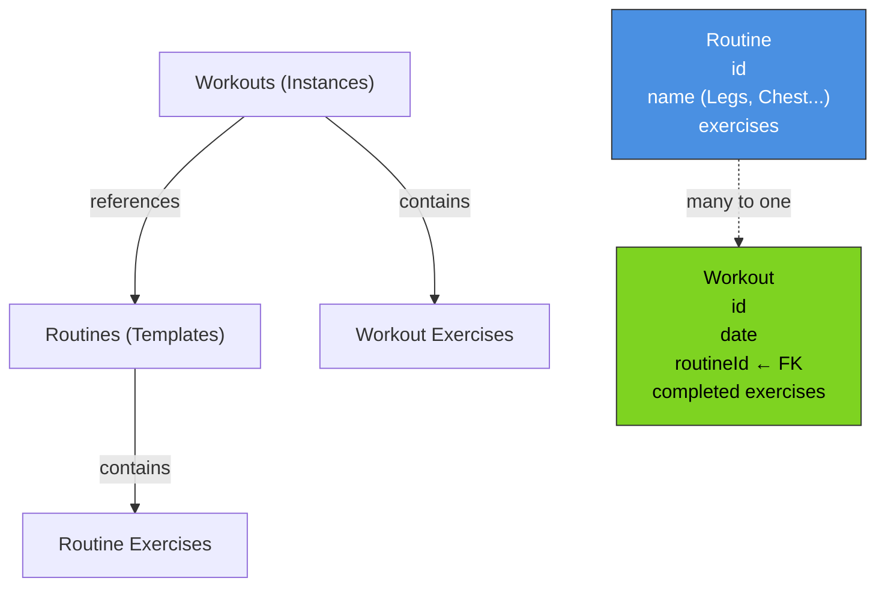

# Workout x Routine Structure

## Concept

- **Routine**: A reusable workout template/program (for example, "Legs", "Chest", and so on). It is not tied to weekdays.
- **Workout**: A single training instance performed once on a specific date.
- **Relationship**: One Routine can be used by many Workouts, but each Workout references only one Routine.

## Diagram



## Data Structure

### Routines (reusable templates)
```
routines
  ├─ id: "legs-01"
  ├─ name: "Legs"
  ├─ detail: null
  ├─ description: "Complete leg workout"
  ├─ isFavorite: true
  └─ exercises: [leg-press, squat, hack-squat, ...]
```

### Workouts (single instances)
```
workouts
  ├─ id: "w1"
  ├─ date: "2026-04-12"
  ├─ routineId: "legs-01" ← references the routine used
  ├─ duration: 45
  ├─ notes: "Hard session today"
  └─ exercises: [
       { exerciseId: "leg-press", sets: 3, reps: 10 },
       { exerciseId: "squat", sets: 3, reps: 12 },
       ...
     ]
```

```
workouts
  ├─ id: "w2"
  ├─ date: "2026-04-14" ← same routine, different day
  ├─ routineId: "legs-01"
  ├─ duration: 50
  └─ exercises: [...]
```

## Relationship

```
routines (1) ←─────── many (workouts)

Legs ← can have many workouts
       (the user performed it 3x, 7x, 10x...)
```

Does this diagram match what you mean, or should I adjust it?
